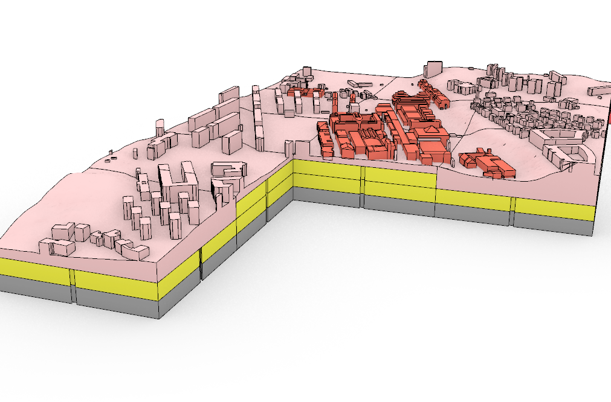
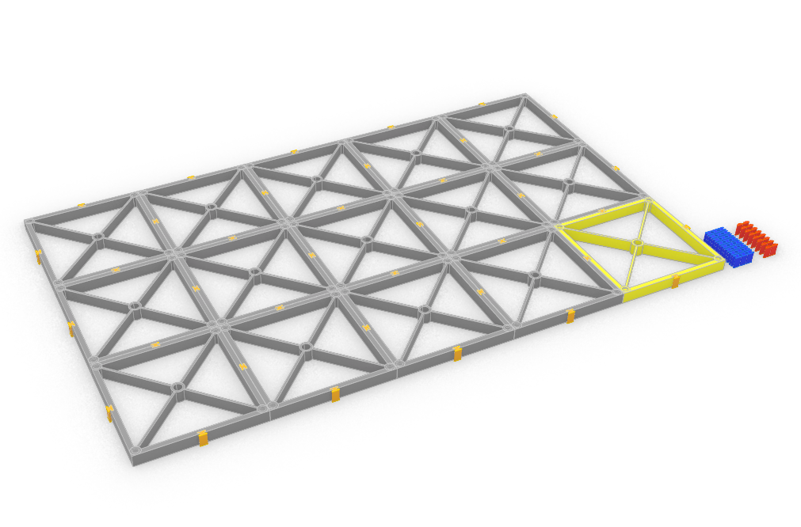
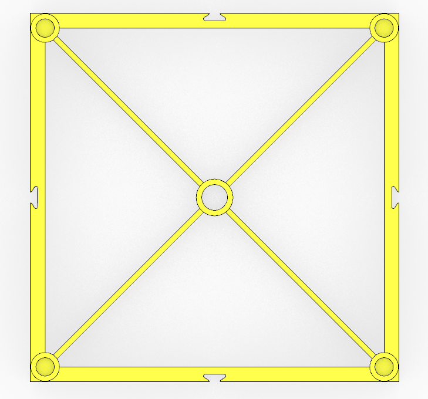
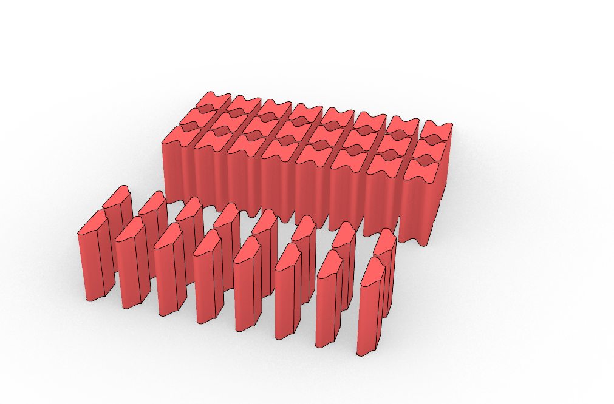
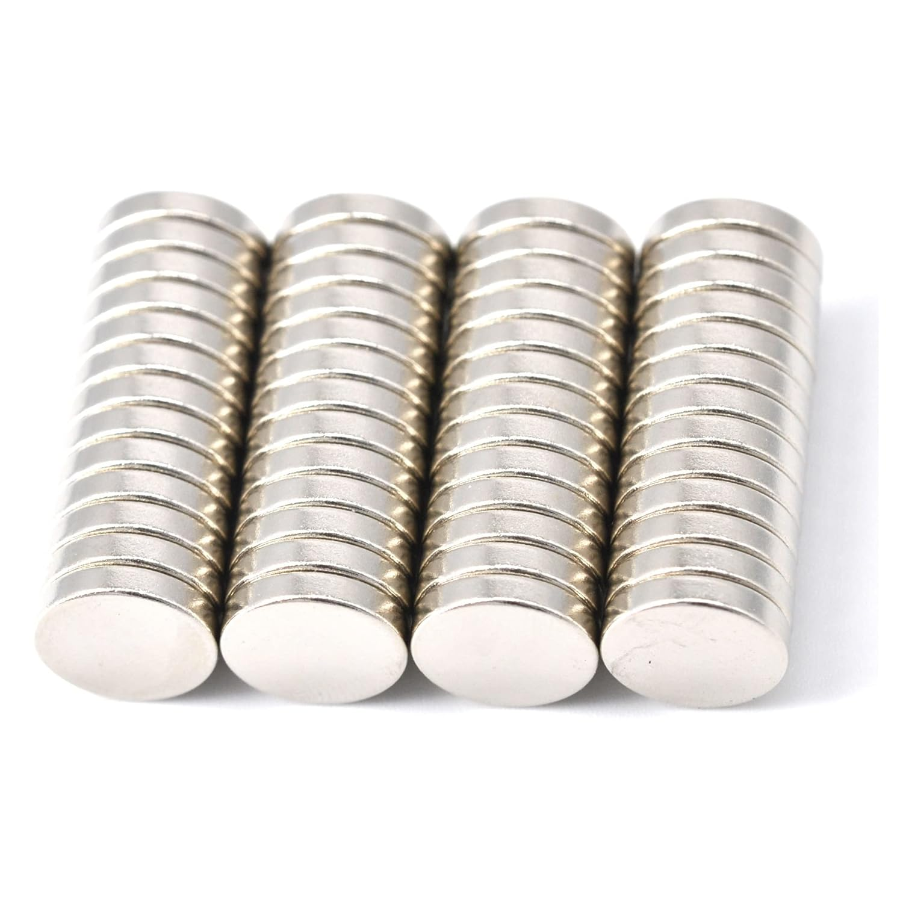

# DTCC Table

Workflow for generating 3D printable tiles of a city model using the [DTCC platform](https://github.com/dtcc-platform/dtcc) and Blender.  
The goal is to create a physical table surface with scaled, magnetized city tiles.



---

## Repository Structure

```

DTCC TABLE/
├─ data/                  # Input datasets
│   ├─ BuildingsKept.gpkg
│   └─ BuildingsRemoved.gpkg
├─ output/                # Generated meshes and tiles (created automatically)
├─ scripts/               # Python scripts
│   ├─ get_city_mesh.py   # Downloads pointcloud, builds terrain, creates scaled city mesh
│   └─ tile_city_mesh.py  # Cuts the mesh into tiles with magnet holes (Blender script)
├─ requirements.txt       # Python dependencies
├─ LICENSE
└─ README.md

````

---

## Workflow

### 1. Generate City Mesh
Run the script to download data, process footprints, and build a scaled STL mesh.

```bash
python scripts/get_city_mesh.py
````

This will create:

* `output/mesh.stl` → full raw city mesh
* `output/scaled_mesh.stl` → scaled and centered mesh for printing

---

### 2. Tile the Mesh (Blender)

Use Blender in **headless mode** to split the mesh into printable tiles with magnet holes.

```bash
blender -b -P scripts/tile_city_mesh.py
```

Outputs will be written to:

* `output/tile_{col}_{row}.stl`

---

## Parameters

* **Scale**: Default is `1:1250`
* **Tile size**: `0.20 m` (printed dimension)
* **Magnets**: 5 mm radius × 2 mm depth, with countersink and 4 mm inset from edges
* **Underside fill**: Quantized to 20 mm steps, anchored at Z=0

You can modify these directly in the scripts or extend them to accept CLI arguments.

---

## Requirements

Python packages (for `get_city_mesh.py`):

```
dtcc
dtcc-core
trimesh
```

For tiling you need **Blender 3.x** with the `io_mesh_stl` add-on enabled (default).

Install dependencies:

```bash
pip install -r requirements.txt
```

---

## Notes

* Place your `BuildingsKept.gpkg` and `BuildingsRemoved.gpkg` files into the `data/` folder.
* The `output/` folder is created automatically.
* `scripts/get_city_mesh.py` can be used standalone (no Blender).
* `scripts/tile_city_mesh.py` must be run inside Blender.

## Table Design

The table system has been developed to be **lightweight, modular, and portable**, making it easy to transport, assemble, and reconfigure.  
It is based on a grid of standardized tiles that serve as interchangeable units. Each tile can be **stacked, extended, or swapped** depending on the needs of the model.

### Key Features

- **Standardized Tiles**  
  Each tile follows the same size and geometry specification. This makes the system scalable — from a small 2×2 layout to a large multi-tile table.  

- **Interchangeable Terrain and Building Layers**  
  Students only need to prepare their **Rhino models for buildings**. These can be swapped onto existing terrain tiles without redesigning the entire base, reducing time and complexity.  

- **Lightweight Structural Base**  
  Tiles are reinforced with diagonal ribs and a central hub, ensuring stiffness while minimizing material usage and weight.  

### Connection System

To ensure easy assembly and reliable alignment, the tiles are joined using a combination of connectors and embedded magnets:

- **Outer Connectors (Flush Pieces)**  
  Used on the edges of the table to create a clean, stable boundary. These sit flush with the tile edge.  

- **Butterfly Connectors (Interlocking Pieces)**  
  Placed between tiles, these snap two neighboring tiles together securely. Their geometry prevents sliding while still allowing quick disassembly.  

- **Magnets (10 mm × 2 mm)**  
  Neodymium disc magnets are embedded into the corners and edges of tiles. These ensure tiles click into place automatically during assembly.  
  The magnets are inexpensive and readily available online (e.g., Amazon), making the system accessible for students and labs.  

---

### Visual Guide

**Overall table layout with modular base tiles**  


**Single tile detail showing reinforcement ribs and magnet positions**  


**Assembly of multiple tiles into a full table with connectors**  


**Connector pieces: outer flush connectors (blue) and butterfly interlocking connectors (red)**  


**Magnets (10 mm × 2 mm) used in tile corners and edges**  


**Example with terrain + buildings mounted on top of the modular tiles**  


---
